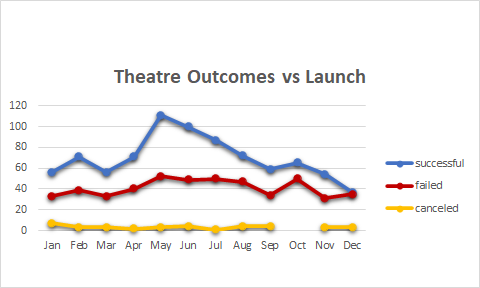
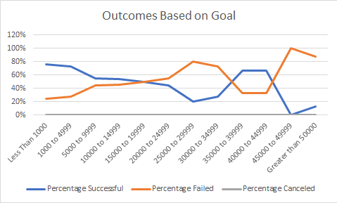

# An Analysis of Kickstarter Campaigns
Performing analysis on Kickstarter data to uncover trends

## Overview of Project
* Using data provided on Kickstarter Campaigns to complete an analysis that will give further insights into the kickstarter industry.

### Purpose
* The purpose and background are well defined (2 pt).
* Overview of Project: Explain the purpose of this analysis.

* The purpose of this analysis was to determine the relationship between kickstarter campaign launch dates and their funding goals to see what impact they have on overall outcomes.
* The client needed to know how different campaigns fared in relation to their lunch dates and their funding goals to determine the next steps to take for their Kickstarter.

## Analysis and Challenges

### Analysis of Outcomes based on Launch Date
* Kickstarters that launched in May and June had the highest successful outcomes.
* Campaigns that start in January and Feburary had the highest chance to fail.

### Analysis of Outcomes based on Goals
* Campaigns with lower goals of "Less than 1000" and between "1000 to 4999" had a higher percentage of success.

### Challenges and Difficulties Encountered
* The overview of the analysis is well described with screenshots (2 pt).
* Challenges or difficulties that were encountered, and how they were overcome, are well explained. If there were no difficulties, describe any possible challenges or difficulties that could be encountered (2 pt).
* Explain how you performed your analysis using images and links to code, as well as any challenges you encountered and how you overcame them. If you had no challenges, describe any possible challenges or difficulties that could be encountered.

## Results
* The results of this analysis show that Kickstarter Campaigns have the highest chances of success if they start in the months of May and June coupled with having a fundraising goal of below $4999.

### Limitations
* Dataset is from 2017, need more recent data for it to be relevant to 2021.
* Data heavily weighted with projects that had goals of $14999 or less, making up a total of 92% of total projects. More campagins need to be conducted with a goal of $15000 and more to be able to accurately determine that kickstarters with goals of $4999 are more likely to succeed.

### Recommendations
* It would be beneficial for additional tables and graphs focusing on the following:
**   duration of campagins, comparison of subcategories of theater, comparison of countries.
* Collect more data on failed projects to determine what they have in common?

* Two conclusions are made about the Theater Outcomes by Launch Date (2 pt).
* One conclusion is made about the Outcomes based on Goals (2 pt).
* There is a summary of the limitations of the dataset, and there is a recommendation for additional tables or graphs (2 pt).
* What are two conclusions you can draw about the Theater Outcomes by Launch Date?
* What can you conclude about the Outcomes based on Goals?
* What are some limitations of this dataset?
* What are some other possible tables and/or graphs that we could create?
